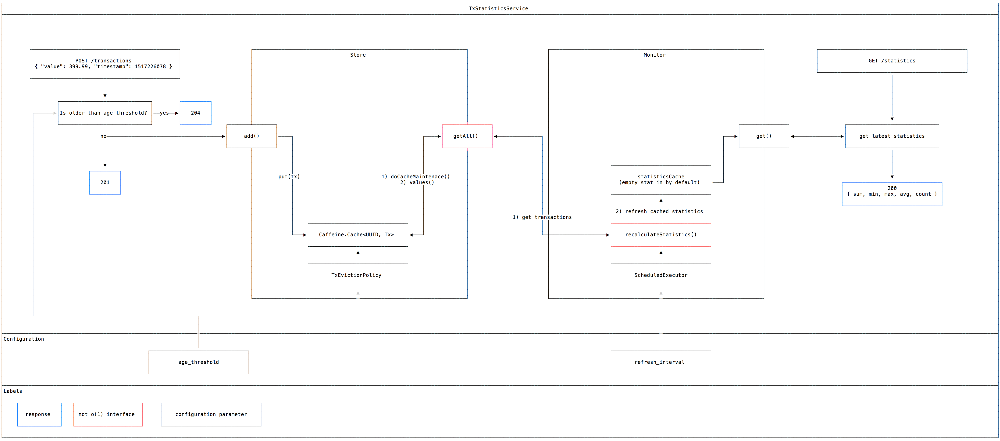

# Transaction Statistics Service

Service responsible for calculating statistics of transactions.

# SYNOPSIS

This is a standalone package, there's no external service dependencies.

1. To test: `mvn test`
2. To package: `mvn package`
3. To run: `java -jar target/transaction-statistics-service.jar server config.yml`
4. To benchmark: `cd bench/; locust --host=http://localhost:8080`
    1. This expects to have a service running on localhost:8080 (default)
    2. This expects that you installed the requirements in your environment

The documentation is made and editable with [Monodraw](https://monodraw.helftone.com/).

# CONFIGURATION

Apart from default dropwizard configuration options, there's two extra configuration parameters you can change
in config.yml:

1. `age_threshold_ms` regulates the ttl of transactions (calculated from the submitted timestamp of the transaction)
    1. transactions posted to /transactions will have to be younger than `now - age_threshold_ms`
    2. transactions stored and included in statistics will be evicted after they become older than `age_threshold_ms`
2. `statistics_refresh_interval_ms` controls how often the statistics are recalculated from the stored transactions

# DESIGN NOTES

## How it works

Both `POST /transactions` and `GET /statistics` is constant time. At the transaction endpoint this is achieved by moving the store and eviction 
efforts into `EvictingTransactionStore`. 

The statistics endpoint is decoupled from the calculating efforts and always returns the last cached statistic from `CachingTransactionMonitor`, which
is recalculates in the background on a schedule set by `statistics_refresh_interval_ms`.

### EvictingTransactionStore

The evicting transaction store is responsible for storing, listing and evicting transactions based on their age 
(controlled by `age_threshold_ms`), it relies on 
[Caffeine](https://github.com/ben-manes/caffeine)'s [Cache](https://github.com/ben-manes/caffeine/blob/master/caffeine/src/main/java/com/github/benmanes/caffeine/cache/Cache.java) 
which offers [O(1) methods](https://github.com/ben-manes/caffeine/issues/75#issuecomment-216614486). 

##### Eviction.

Eviction is done via a custom implementation of [Expiry](https://github.com/ben-manes/caffeine/blob/master/caffeine/src/main/java/com/github/benmanes/caffeine/cache/Expiry.java)
which sets the eviction time based on the difference between the transaction's age and `now - age_threshold_ms`.

In Caffeine, evicted transactions may be removed at following write operations (at a background thread) 
or at most when listing through `EvictingTransactionStore#getTransactions()`.

##### Listing.

When listing transactions, all values from the cache are returned after all pending cleanup efforts in Caffeine are executed to ensure consistent results.

### CachingTransactionMonitor

The transaction monitor is responsible for calculating and caching the latest statistics based on the entries in the store,
a scheduled executor is recalculates the cache at every `statistics_refresh_interval_ms` milliseconds, the result is available as an O(1) get method.

## Limitations

### Memory usage

Since all transactions are stored in-memory, even with Caffeine, a large enough amount of transactions coming in
could cause the service to run out of memory.

### Not horizontally scalable

Given the in-memory nature of the implementation, multiple instances will not share the dataset used to calculate averages,
stress tests to test how performance scales with added hardware would be interesting.

### Not distributed system friendly

There's no Swagger documentation, the `ObjectMapper` is just created here (whereas for (de)serializtion other services
may use their own), there's no health checks nor clock sync, no environments, no json logging for non-dev environments.

### Not (at all) fault tolerant

There's no persistence, i guess that's O.K. for now given the spontanity of the data 
(the data lost may be irrelevant by the time the service is started again).

### No unittest of transaction eviction

A nice, external clock based unittest of the store would make me feel better, did things the fast way here with a bunch of integration tests.

### Weird names

Weird names, probably could be eased if i could talk to a domain expert.

### Positive time discrepancies is not corrected

> The API should be able to deal with time discrepancy, which means, at any point of time, we could receive a transaction which have a timestamp of the past

Timestamps from the future is not excluded from the window of `now - threshold`, i assumed transactions posted here already took place, hope that's ok,
i'm open for discussing how this correction could be implemented. ^^

# GOTCHA

### Not setting "-parameters" argument in your IDE

When you don't set [`-parameters`](https://docs.oracle.com/javase/8/docs/technotes/tools/windows/javac.html#BHCGAJDC) as a compiler argument in your 
IDE (for example when playing around with tests), all sorts of weird things start to happen with (de)serialization, this is because Jackson relies
on the parameter names when you don't explicitly define `@JsonParameter("nameOfParam")` for a constructor argument.

Annotating everything is kinda bloaty, things look a bit cleaner this way, check out the Jackson docs for more. 